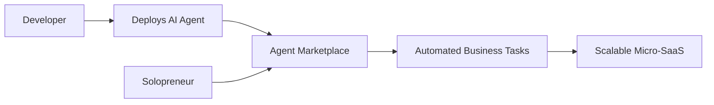

# 🤖 Autonomous AI-Agent Marketplace

### A Marketplace for Micro-SaaS Solopreneurs

**CMPE 295A Final Project • Fall 2026**  
**San José State University**

---

## 📖 Overview

The **Autonomous AI-Agent Marketplace for Micro-SaaS Solopreneurs** is a platform where developers can build and deploy specialized **agentic microservices** capable of autonomously performing complex business operations.

The marketplace is designed to help solopreneurs and small digital businesses access powerful automation without hiring large operational teams or developing sophisticated AI systems from scratch.

---

## 💡 The Concept

Developers publish purpose-built AI agents to a shared marketplace. Solopreneurs can discover, configure, and integrate these agents into their businesses based on their operational needs.

Each agent focuses on a specific business function, such as:

- 🌍 Automated tax compliance across international markets
- 📈 Dynamic pricing based on market trends and customer sentiment
- 💬 Autonomous customer support and ticket resolution
- 📊 Business analytics and performance reporting
- 📣 Marketing campaign optimization
- 🧾 Invoice generation and financial workflow automation

---

## 🎯 Project Impact

### Social Impact

The platform makes advanced AI-powered business automation accessible to independent creators, entrepreneurs, and small teams that may not have extensive technical or financial resources.

### Business Impact

By delegating repetitive and complex operations to specialized AI agents, solopreneurs can:

- Reduce operational costs
- Save time on routine business tasks
- Scale their products more efficiently
- Make faster, data-driven decisions
- Focus on product development and customer value

---

## ⚙️ How It Works

1. **Developers build agents** for specialized business operations.
2. **Agents are deployed** and listed in the marketplace.
3. **Solopreneurs discover agents** that match their business requirements.
4. **Agents are configured and integrated** into existing workflows.
5. **Business tasks are performed autonomously**, with results available for review.

---

## ✨ Key Project Goals

- Create a centralized marketplace for agentic microservices
- Enable developers to publish and manage specialized AI agents
- Help solopreneurs discover and adopt business automation
- Support secure and configurable agent integrations
- Provide visibility into agent activity and performance
- Make autonomous business operations accessible to small creators

---

## 👥 Team Members

| Name | SJSU ID | Email | Program | Batch |
|---|---:|---|---|---|
| **Nikhil Hiro Ghind** | 019115590 | [nikhilhiro.ghind@sjsu.edu](mailto:nikhilhiro.ghind@sjsu.edu) | MS in Software Engineering | Fall 2025 |
| **Vineet Kumar** | 019140433 | [vineet.kumar@sjsu.edu](mailto:vineet.kumar@sjsu.edu) | MS in Software Engineering | Fall 2025 |
| **Sakshat Nandkumar Patil** | 018318287 | [sakshatnandkumar.patil@sjsu.edu](mailto:sakshatnandkumar.patil@sjsu.edu) | MS in Software Engineering | January 2025 |

---

## 🎓 Faculty Advisor

**Professor Rakesh Ranjan**  
San José State University

---

## 🗺️ Project Roadmap

- [ ] Requirements analysis and system design
- [ ] Marketplace architecture
- [ ] Developer agent-publishing workflow
- [ ] Agent discovery and selection
- [ ] Agent configuration and integration
- [ ] Monitoring and performance dashboard
- [ ] Security and access controls
- [ ] Testing and evaluation
- [ ] Final deployment and presentation

---

## 📌 Project Status

> This project is currently under active development as part of **CMPE 295A — Fall 2026** at **San José State University**.

---

### Empowering solopreneurs—one autonomous agent at a time.

